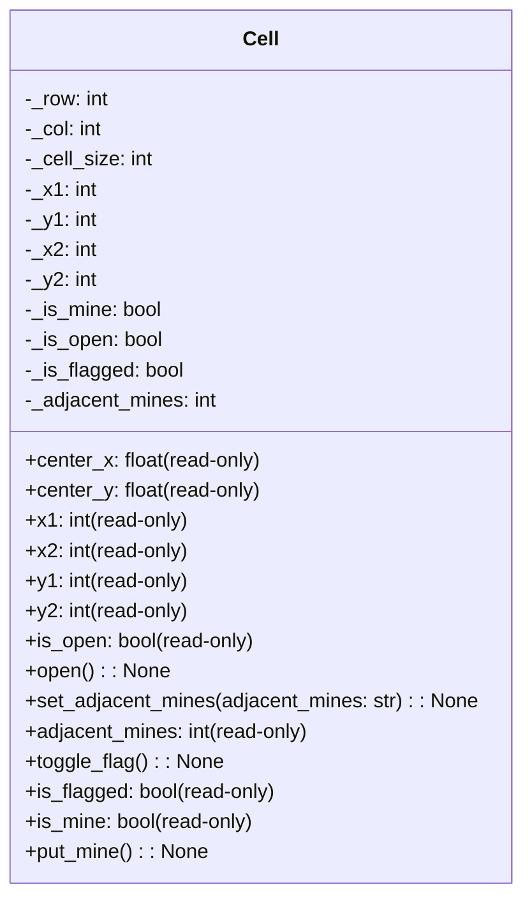

```mermaid
classDiagram
    class Cell {
        -_row: int
        -_col: int
        -_cell_size: int
        -_x1: int
        -_y1: int
        -_x2: int
        -_y2: int
        -_is_mine: bool
        -_is_open: bool
        -_is_flagged: bool
        -_adjacent_mines: int
        +center_x: float (read-only)
        +center_y: float (read-only)
        +x1: int (read-only)
        +x2: int (read-only)
        +y1: int (read-only)
        +y2: int (read-only)
        +is_open: bool (read-only)
        +open(): None
        +set_adjacent_mines(adjacent_mines: str): None
        +adjacent_mines: int (read-only)
        +toggle_flag(): None
        +is_flagged: bool (read-only)
        +is_mine: bool (read-only)
        +put_mine(): None
    }
```