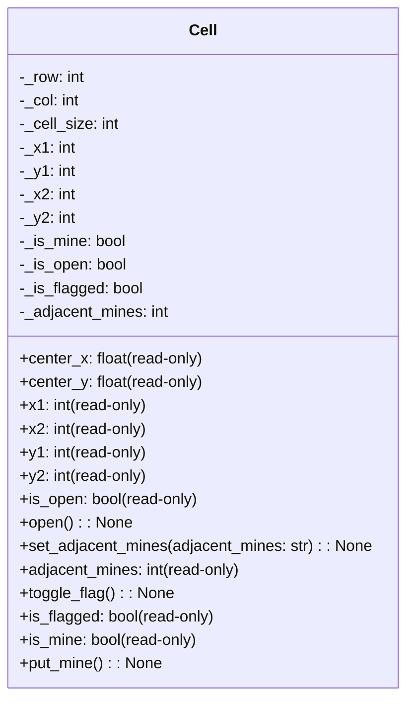

| Name             | Access | Member Type   | Data Type | Description                                                                                                                                      |
|------------------|--------|--------------|-----------|--------------------------------------------------------------------------------------------------------------------------------------------------|
| `__init__`       | Public | Method       | None      | Initializes a Cell instance with the given row, column, and cell size, calculates its position, and sets initial cell properties.                |
| `center_x`       | Public | Property     | float     | Returns the x-coordinate of the center of the cell.                                                                                              |
| `center_y`       | Public | Property     | float     | Returns the y-coordinate of the center of the cell.                                                                                              |
| `x1`             | Public | Property     | int       | Returns the x-coordinate of the top-left corner of the cell.                                                                                     |
| `x2`             | Public | Property     | int       | Returns the x-coordinate of the bottom-right corner of the cell.                                                                                 |
| `y1`             | Public | Property     | int       | Returns the y-coordinate of the top-left corner of the cell.                                                                                     |
| `y2`             | Public | Property     | int       | Returns the y-coordinate of the bottom-right corner of the cell.                                                                                 |
| `is_open`        | Public | Property     | bool      | Returns whether the cell is open or not.                                                                                                         |
| `open`           | Public | Method       | None      | Opens the cell if it is not flagged.                                                                                                             |
| `set_adjacent_mines` | Public | Method   | None      | Sets the number of adjacent mines to the cell.                                                                                                   |
| `adjacent_mines` | Public | Property     | int       | Returns the number of adjacent mines.                                                                                                            |
| `toggle_flag`    | Public | Method       | None      | Toggles the flagged state of the cell if it is not open.                                                                                         |
| `is_flagged`     | Public | Property     | bool      | Returns whether the cell is flagged or not.                                                                                                      |
| `is_mine`        | Public | Property     | bool      | Returns whether the cell is a mine or not.                                                                                                       |
| `put_mine`       | Public | Method       | None      | Sets the cell as a mine.                                                                                                                         |
| `_row`           | Private| Variable     | int       | The row number of the cell.                                                                                                                      |
| `_col`           | Private| Variable     | int       | The column number of the cell.                                                                                                                   |
| `_cell_size`     | Private| Variable     | int       | The size of the cell in pixels.                                                                                                                  |
| `_x1`            | Private| Variable     | int       | The x-coordinate of the top-left corner of the cell.                                                                                             |
| `_y1`            | Private| Variable     | int       | The y-coordinate of the top-left corner of the cell.                                                                                             |
| `_x2`            | Private| Variable     | int       | The x-coordinate of the bottom-right corner of the cell.                                                                                         |
| `_y2`            | Private| Variable     | int       | The y-coordinate of the bottom-right corner of the cell.                                                                                         |
| `_is_mine`       | Private| Variable     | bool      | Indicates whether the cell is a mine or not.                                                                                                     |
| `_is_open`       | Private| Variable     | bool      | Indicates whether the cell is open or not.                                                                                                       |
| `_is_flagged`    | Private| Variable     | bool      | Indicates whether the cell is flagged or not.                                                                                                    |
| `_adjacent_mines`| Private| Variable     | int       | The number of adjacent mines to the cell.|
