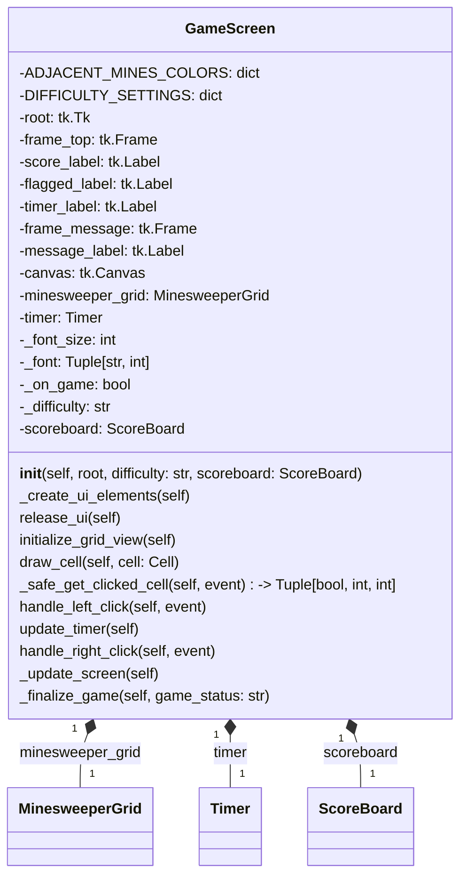

| Name                  | Access  | Member Type | Data Type        | Description                                                                                                                                                                                                                       |
|-----------------------|---------|-------------|------------------|-----------------------------------------------------------------------------------------------------------------------------------------------------------------------------------------------------------------------------------|
| ADJACENT_MINES_COLORS | Public  | Variable    | Dict[int, str]   | A dictionary that maps the number of adjacent mines to the corresponding color for displaying the text.                                                                                                                            |
| DIFFICULTY_SETTINGS   | Public  | Variable    | Dict[str, Tuple] | A dictionary that maps the difficulty level to a tuple containing the number of rows, columns, and mines for the game.                                                                                                            |
| __init__              | Public  | Method      | None             | The constructor initializes the game screen with the given root, difficulty, and scoreboard, and creates the UI elements for the game.                                                                                            |
| _create_ui_elements   | Private | Method      | None             | This method creates the UI elements like score, flagged mines, timer, message, and canvas.                                                                                                                                        |
| release_ui            | Public  | Method      | None             | This method releases all the UI elements and unbinds event handlers.                                                                                                                                                              |
| initialize_grid_view  | Public  | Method      | None             | This method initializes the grid view by drawing the base rectangles for each cell.                                                                                                                                                |
| draw_cell             | Public  | Method      | None             | This method draws a cell based on its state (open, closed, flagged, or with a mine).                                                                                                                                               |
| _safe_get_clicked_cell | Private | Method      | Tuple[bool, int, int] | This method returns a tuple containing a boolean indicating whether the clicked cell is in range and the row and column of the clicked cell.                                                                                       |
| handle_left_click     | Public  | Method      | None             | This method handles left-click events on the canvas, opens the clicked cell, and checks for game status.                                                                                                                          |
| update_timer          | Public  | Method      | None             | This method updates the timer label and schedules itself to be called every 1000 milliseconds (1 second).                                                                                                                         |
| handle_right_click    | Public  | Method      | None             | This method handles right-click events on the canvas, flags or unflags the clicked cell, and checks for game status.                                                                                                              |
| _update_screen        | Private | Method      | None             | This method updates the score label and flagged label on the screen.                                                                                                                                                              |
| _finalize_game        | Private | Method      | None             | This method finalizes the game by stopping the timer, updating the game status, and updating the scoreboard and high scores if the game is won. It also displays a message indicating whether the player has won or lost the game. |

