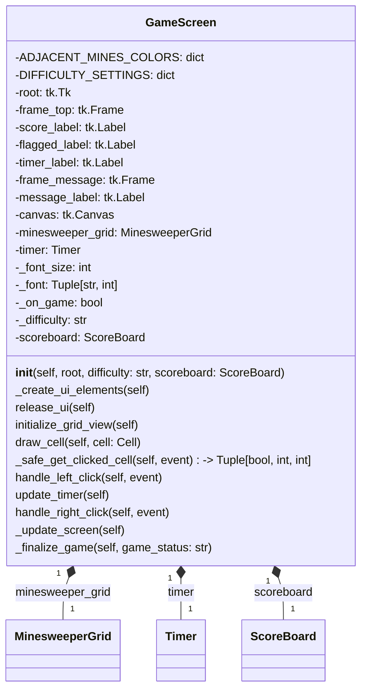

```mermaid
classDiagram
    class GameScreen {
        -ADJACENT_MINES_COLORS: dict
        -DIFFICULTY_SETTINGS: dict
        -root: tk.Tk
        -frame_top: tk.Frame
        -score_label: tk.Label
        -flagged_label: tk.Label
        -timer_label: tk.Label
        -frame_message: tk.Frame
        -message_label: tk.Label
        -canvas: tk.Canvas
        -minesweeper_grid: MinesweeperGrid
        -timer: Timer
        -_font_size: int
        -_font: Tuple[str, int]
        -_on_game: bool
        -_difficulty: str
        -scoreboard: ScoreBoard
        __init__(self, root, difficulty: str, scoreboard: ScoreBoard)
        _create_ui_elements(self)
        release_ui(self)
        initialize_grid_view(self)
        draw_cell(self, cell: Cell)
        _safe_get_clicked_cell(self, event) -> Tuple[bool, int, int]
        handle_left_click(self, event)
        update_timer(self)
        handle_right_click(self, event)
        _update_screen(self)
        _finalize_game(self, game_status: str)
    }
    GameScreen "1" *-- "1" MinesweeperGrid: minesweeper_grid
    GameScreen "1" *-- "1" Timer: timer
    GameScreen "1" *-- "1" ScoreBoard: scoreboard
```
