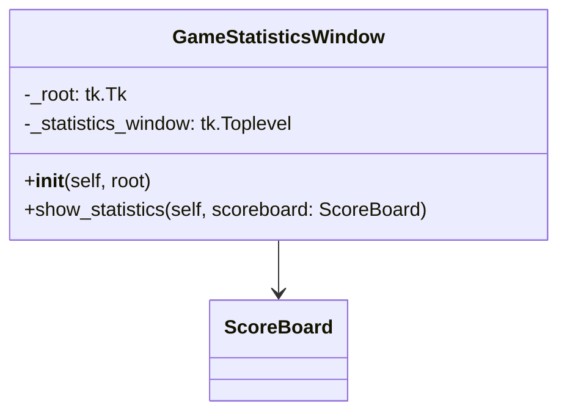

```mermaid
classDiagram
    class GameStatisticsWindow {
        -_root: tk.Tk
        -_statistics_window: tk.Toplevel
        +__init__(self, root)
        +show_statistics(self, scoreboard: ScoreBoard)
    }
    GameStatisticsWindow --> ScoreBoard
```
