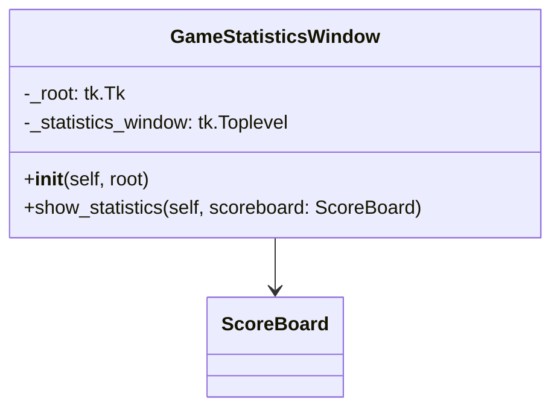

| Name                 | Access | Member Type | Data Type          | Description                                                                                                                                     |
|----------------------|--------|-------------|--------------------|-------------------------------------------------------------------------------------------------------------------------------------------------|
| `__init__`           | Public | Method      | None               | Initializes the GameStatisticsWindow object with a given `root` window.                                                                         |
| `show_statistics`    | Public | Method      | None               | Displays the game statistics in a new window, given a `scoreboard` object.                                                                      |
| `_root`              | Private| Variable    | tkinter.Tk         | Reference to the root window (main window) of the application.                                                                                   |
| `_statistics_window` | Private| Variable    | tkinter.Toplevel \| None| Reference to the current statistics window. Set to `None` when there is no open statistics window. |

Note that the other variables defined within methods such as `tree`, `level_label`, `games_played_label`, etc., are local variables and are not included in the table as they are not members of the class.
