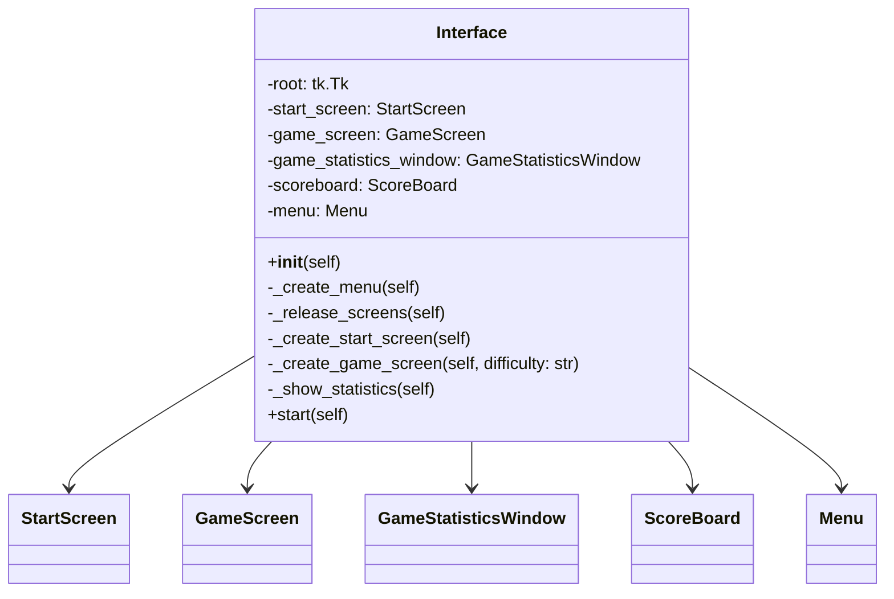

| Name                      | Access | Member Type | Data Type            | Description                                                                                                                                                       |
|---------------------------|--------|-------------|----------------------|-------------------------------------------------------------------------------------------------------------------------------------------------------------------|
| `__init__`                | Public | Method      | None                 | Initializes the Interface instance, sets up the tkinter window and its menu, and creates the start screen.                                                         |
| `start`                   | Public | Method      | None                 | Starts the tkinter main loop if the start screen is present.                                                                                                      |
| `_create_menu`            | Private| Method      | None                 | Creates the menu for the application using the Menu class, providing a dictionary with the necessary callback methods.                                             |
| `_release_screens`        | Private| Method      | None                 | Releases the start and game screens, setting them to None.                                                                                                        |
| `_create_start_screen`    | Private| Method      | None                 | Releases any existing screens and creates a new start screen.                                                                                                     |
| `_create_game_screen`     | Private| Method      | None                 | Releases any existing screens and creates a new game screen with the given difficulty.                                                                            |
| `_show_statistics`        | Private| Method      | None                 | Shows the game statistics using the GameStatisticsWindow class.                                                                                                   |
| `root`                    | Private| Variable    | tkinter.Tk           | The root tkinter window for the application.                                                                                                                       |
| `start_screen`            | Private| Variable    | StartScreen or None  | The instance of the start screen, or None if not currently active.                                                                                                |
| `game_screen`             | Private| Variable    | GameScreen or None   | The instance of the game screen, or None if not currently active.                                                                                                 |
| `game_statistics_window`  | Private| Variable    | GameStatisticsWindow | The instance of the game statistics window used to display game statistics.                                                                                       |
| `scoreboard`              | Private| Variable    | ScoreBoard           | The instance of the ScoreBoard class used to store game scores.                                                                                                   |
| `menu`                    | Private| Variable    | Menu                 | The instance of the Menu class used to create the application menu.                                                                                               |
