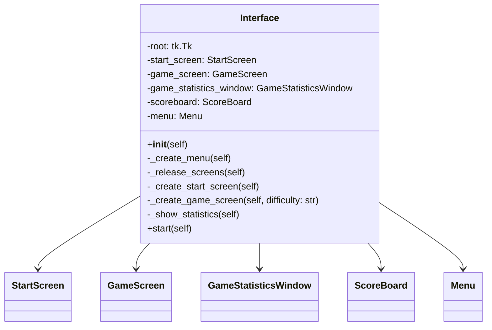

```mermaid
classDiagram
    class Interface {
        -root: tk.Tk
        -start_screen: StartScreen
        -game_screen: GameScreen
        -game_statistics_window: GameStatisticsWindow
        -scoreboard: ScoreBoard
        -menu: Menu
        +__init__(self)
        -_create_menu(self)
        -_release_screens(self)
        -_create_start_screen(self)
        -_create_game_screen(self, difficulty: str)
        -_show_statistics(self)
        +start(self)
    }
    Interface --> StartScreen
    Interface --> GameScreen
    Interface --> GameStatisticsWindow
    Interface --> ScoreBoard
    Interface --> Menu
```