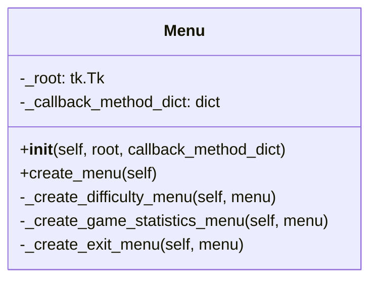

```mermaid
classDiagram
    class Menu {
        -_root: tk.Tk
        -_callback_method_dict: dict
        +__init__(self, root, callback_method_dict)
        +create_menu(self)
        -_create_difficulty_menu(self, menu)
        -_create_game_statistics_menu(self, menu)
        -_create_exit_menu(self, menu)
    }
```
