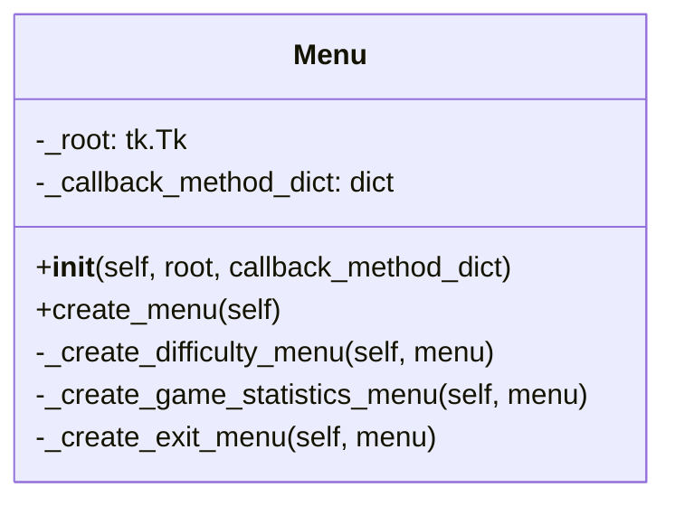

| Name                      | Access | Member Type | Data Type                 | Description                                                                                                 |
|---------------------------|--------|-------------|---------------------------|-------------------------------------------------------------------------------------------------------------|
| `__init__`                | Public | Method      | None                      | Initializes the Menu object with a given `root` window and `callback_method_dict` dictionary.              |
| `create_menu`             | Public | Method      | tkinter.Menu              | Creates the main menu and returns it.                                                                       |
| `_create_difficulty_menu` | Private| Method      | None                      | Creates the Difficulty submenu and adds it to the given `menu`.                                            |
| `_create_game_statistics_menu`| Private| Method   | None                      | Adds the Game Statistics menu option to the given `menu`.                                                  |
| `_create_exit_menu`       | Private| Method      | None                      | Adds the Exit menu option to the given `menu`.                                                             |
| `_root`                   | Private| Variable    | tkinter.Tk                | Reference to the root window (main window) of the application.                                             |
| `_callback_method_dict`   | Private| Variable    | Dict[str, Callable[..., Any]]| Dictionary that maps callback method names to their corresponding functions, used for menu actions.       |

Please note that local variables, Tkinter options like `label`, and the `command` parameter for menu items are not included in the table as they are not members of the class.

