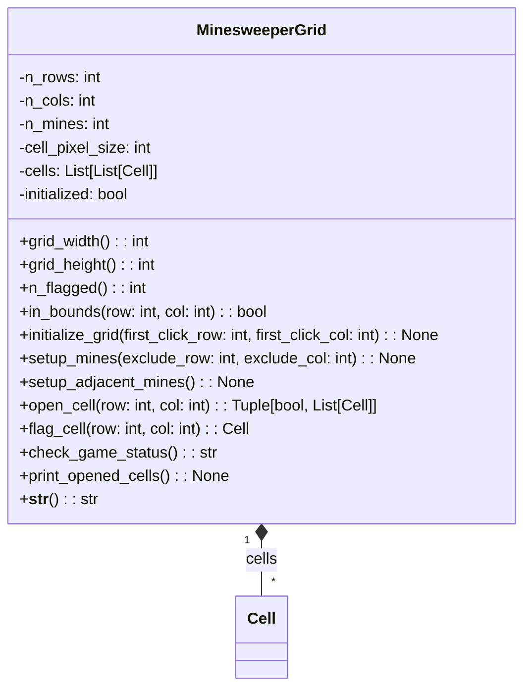

| Name                   | Access | Member Type | Data Type            | Description                                                                                                                                           |
|------------------------|--------|-------------|----------------------|-------------------------------------------------------------------------------------------------------------------------------------------------------|
| `__init__`             | Public | Method      | None                 | Initializes the MinesweeperGrid instance with the given number of rows, columns, and mines and creates the grid with Cell objects.                    |
| `grid_width`           | Public | Property    | int                  | Returns the width of the grid in pixels.                                                                                                              |
| `grid_height`          | Public | Property    | int                  | Returns the height of the grid in pixels.                                                                                                             |
| `n_flagged`            | Public | Property    | int                  | Returns the number of flagged cells in the grid.                                                                                                      |
| `in_bounds`            | Public | Method      | bool                 | Returns True if the given row and column are within the grid bounds, otherwise False.                                                                 |
| `initialize_grid`      | Public | Method      | None                 | Sets up the grid with mines and adjacent mines after the first click.                                                                                 |
| `open_cell`            | Public | Method      | Tuple[bool, List[Cell]] | Opens the cell at the given row and column and returns a tuple with a boolean indicating if a mine was hit and a list of opened cells.               |
| `flag_cell`            | Public | Method      | Cell                 | Toggles the flag status of the cell at the given row and column and returns the modified cell.                                                        |
| `check_game_status`    | Public | Method      | str                  | Returns the game status as "lost", "won", or "ongoing" based on the opened and flagged cells in the grid.                                             |
| `print_opened_cells`   | Public | Method      | None                 | Prints a textual representation of the opened cells in the grid.                                                                                      |
| `__str__`              | Public | Method      | str                  | Returns a string representation of the grid with mines and adjacent mines count.                                                                      |
| `setup_mines`          | Private| Method      | None                 | Sets up the mines in the grid, excluding the cell at the given row and column.                                                                        |
| `setup_adjacent_mines` | Private| Method      | None                 | Sets up the adjacent mines count for each cell in the grid.                                                                                           |
| `n_rows`               | Private| Variable    | int                  | The number of rows in the grid.                                                                                                                       |
| `n_cols`               | Private| Variable    | int                  | The number of columns in the grid.                                                                                                                    |
| `n_mines`              | Private| Variable    | int                  | The number of mines in the grid.                                                                                                                      |
| `cell_pixel_size`      | Private| Variable    | int                  | The size of each cell in pixels.                                                                                                                      |
| `cells`                | Private| Variable    | List[List[Cell]]     | The 2D list containing Cell instances for each position in the grid.                                                                                  |
| `initialized`          | Private| Variable    | bool                 | A boolean indicating whether the grid has been initialized with mines and adjacent mines after the first click.                                       |

