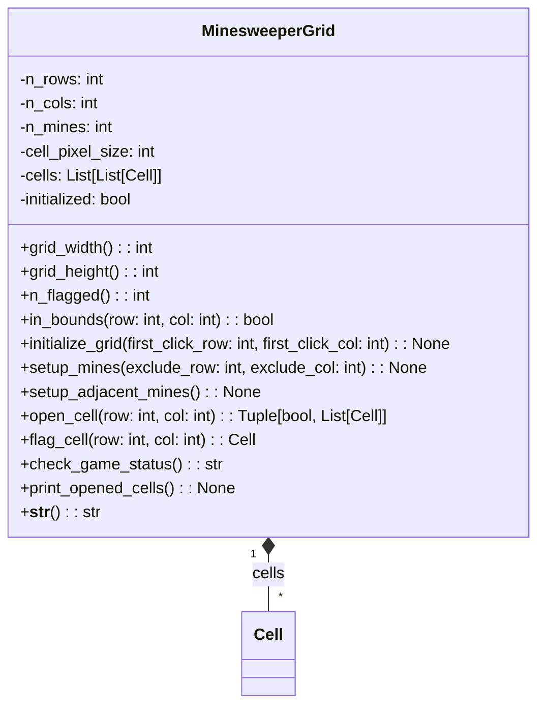

```mermaid
classDiagram
    class MinesweeperGrid {
        -n_rows: int
        -n_cols: int
        -n_mines: int
        -cell_pixel_size: int
        -cells: List[List[Cell]]
        -initialized: bool
        +grid_width(): int
        +grid_height(): int
        +n_flagged(): int
        +in_bounds(row: int, col: int): bool
        +initialize_grid(first_click_row: int, first_click_col: int): None
        +setup_mines(exclude_row: int, exclude_col: int): None
        +setup_adjacent_mines(): None
        +open_cell(row: int, col: int): Tuple[bool, List[Cell]]
        +flag_cell(row: int, col: int): Cell
        +check_game_status(): str
        +print_opened_cells(): None
        +__str__(): str
    }
    MinesweeperGrid "1" *-- "*" Cell: cells
```
