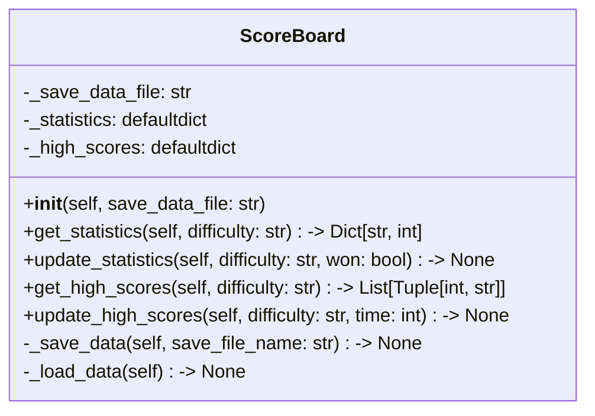

| Name                | Access | Member Type   | Data Type                   | Description                                                                                                              |
|---------------------|--------|---------------|------------------------------|--------------------------------------------------------------------------------------------------------------------------|
| `__init__`          | Public | Method        | None                         | Initializes the ScoreBoard instance with save data file and loads data from the file.                                    |
| `get_statistics`    | Public | Method        | Dict[str, int]               | Returns the statistics for the given difficulty.                                                                         |
| `update_statistics` | Public | Method        | None                         | Updates the statistics for the given difficulty based on the game result and saves the data.                             |
| `get_high_scores`   | Public | Method        | List[Tuple[int, str]]        | Returns the high scores for the given difficulty.                                                                        |
| `update_high_scores`| Public | Method        | None                         | Updates the high scores for the given difficulty with new time, sorts the list, and saves the data.                      |
| `_save_data`        | Private| Method        | None                         | Saves the statistics and high scores data to the specified file.                                                         |
| `_load_data`        | Private| Method        | None                         | Loads the statistics and high scores data from the specified file or sets default values if the file doesn't exist.      |
| `_check_difficulty` | Private| Method        | None                         | Validates the given difficulty and raises an error if it's not valid.                                                    |
| `_save_data_file`   | Private| Variable      | str                          | The file name of the save data file.                                                                                     |
| `_statistics`       | Private| Variable      | defaultdict(lambda: defaultdict(int)) | The nested defaultdict containing the game statistics for each difficulty.                        |
| `_high_scores`      | Private| Variable      | defaultdict(list)           | The defaultdict containing the list of high scores for each difficulty.                                                  |

