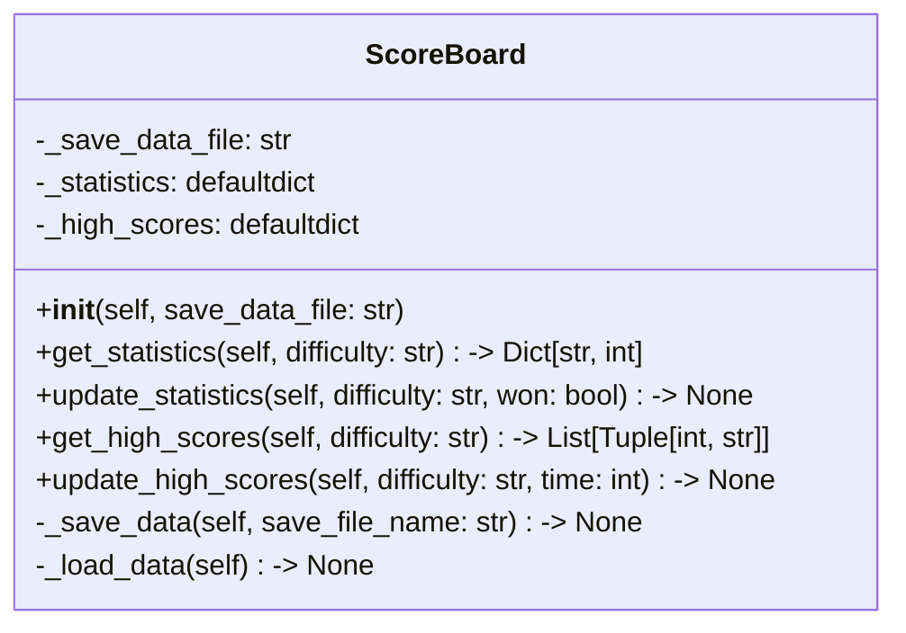

```mermaid
classDiagram
    class ScoreBoard {
        -_save_data_file: str
        -_statistics: defaultdict
        -_high_scores: defaultdict
        +__init__(self, save_data_file: str)
        +get_statistics(self, difficulty: str) -> Dict[str, int]
        +update_statistics(self, difficulty: str, won: bool) -> None
        +get_high_scores(self, difficulty: str) -> List[Tuple[int, str]]
        +update_high_scores(self, difficulty: str, time: int) -> None
        -_save_data(self, save_file_name: str) -> None
        -_load_data(self) -> None
    }
```