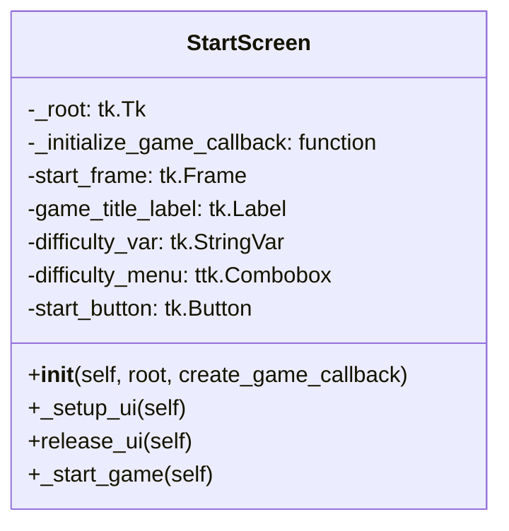

```mermaid
classDiagram
    class StartScreen {
        -_root: tk.Tk
        -_initialize_game_callback: function
        -start_frame: tk.Frame
        -game_title_label: tk.Label
        -difficulty_var: tk.StringVar
        -difficulty_menu: ttk.Combobox
        -start_button: tk.Button
        +__init__(self, root, create_game_callback)
        +_setup_ui(self)
        +release_ui(self)
        +_start_game(self)
    }
```