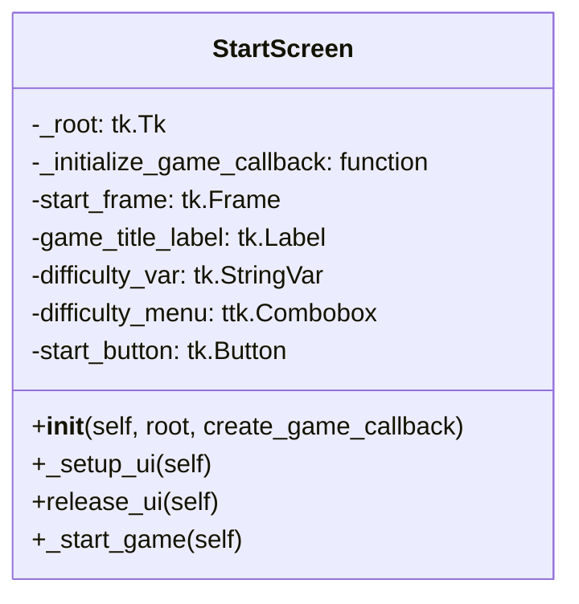

| Name                       | Access | Member Type | Data Type              | Description                                                                                          |
|----------------------------|--------|-------------|------------------------|------------------------------------------------------------------------------------------------------|
| `__init__`                 | Public | Method      | None                   | Initializes the StartScreen object with a given `root` window and `create_game_callback` function.   |
| `_setup_ui`                | Private| Method      | None                   | Sets up the UI components for the start screen.                                                      |
| `release_ui`               | Public | Method      | None                   | Releases (hides) the UI components of the start screen.                                              |
| `_start_game`              | Private| Method      | None                   | Starts the game with the selected difficulty and releases the start screen UI.                       |
| `_root`                    | Private| Variable    | tkinter.Tk             | Reference to the root window (main window) of the application.                                       |
| `_initialize_game_callback`| Private| Variable    | Callable[[str], None]  | Callback function to create a game with the given difficulty.                                        |
| `start_frame`              | Public | Variable    | tkinter.Frame          | The main frame containing all the components of the start screen.                                    |
| `game_title_label`         | Public | Variable    | tkinter.Label \| None  | Label displaying the game title.                                                                     |
| `difficulty_var`           | Public | Variable    | tkinter.StringVar      | StringVar variable for storing the selected difficulty.                                              |
| `difficulty_menu`          | Public | Variable    | ttk.Combobox \| None   | Combobox for selecting the difficulty level.                                                         |
| `start_button`             | Public | Variable    | tkinter.Button \| None | Button to start the game with the selected difficulty.                                               |

Please note that local variables and Tkinter options like `text`, `font`, `width`, etc., are not included in the table as they are not members of the class.
