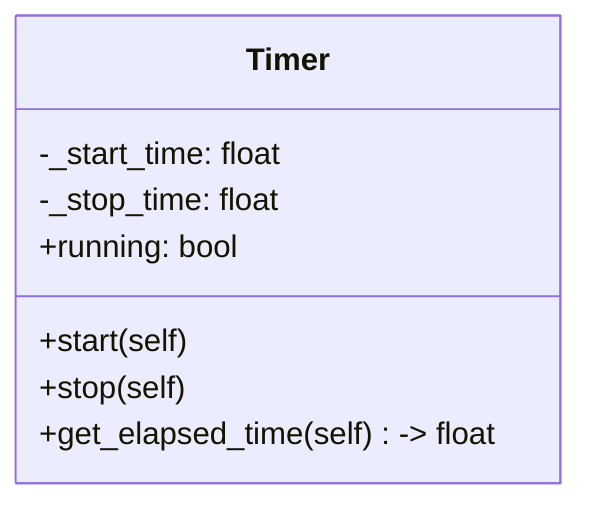

```mermaid
classDiagram
    class Timer {
        -_start_time: float
        -_stop_time: float
        +start(self)
        +stop(self)
        +running: bool
        +get_elapsed_time(self) -> float
    }
```
