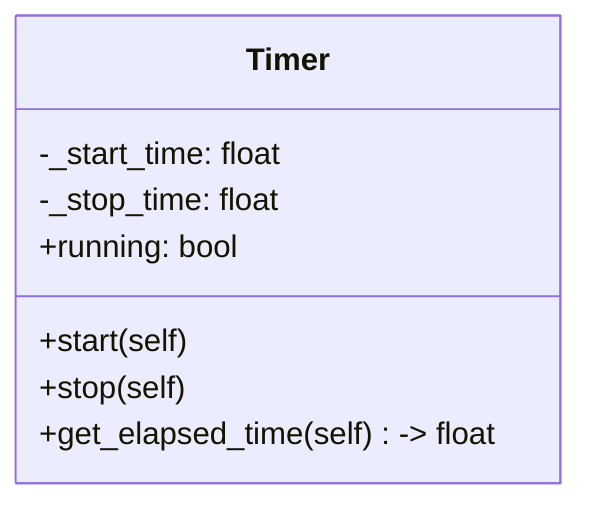

| Name             | Access | Member Type | Data Type | Description                                                                                                                           |
|------------------|--------|-------------|-----------|---------------------------------------------------------------------------------------------------------------------------------------|
| `__init__`       | Public | Method      | None      | Initializes the Timer object, setting `_start_time` and `_stop_time` to `None`.                                                       |
| `start`          | Public | Method      | None      | Starts the timer by setting `_start_time` to the current time and `_stop_time` to `None`.                                             |
| `stop`           | Public | Method      | None      | Stops the timer by setting `_stop_time` to the current time.                                                                          |
| `running`        | Public | Property    | bool      | Returns `True` if the timer is running (i.e., `_start_time` is set and `_stop_time` is `None`), otherwise returns `False`.            |
| `get_elapsed_time`| Public| Method      | float     | Returns the elapsed time in seconds. If the timer is running, returns the difference between the current time and `_start_time`. If the timer has stopped, returns the difference between `_stop_time` and `_start_time`. If the timer has not started, returns 0.0.|
| `_start_time`    | Private| Variable    | float \| None | Holds the start time of the timer. Set to `None` when the timer is not running.                                                       |
| `_stop_time`     | Private| Variable    | float \| None | Holds the stop time of the timer. Set to `None` when the timer is running or not started.                                             |

