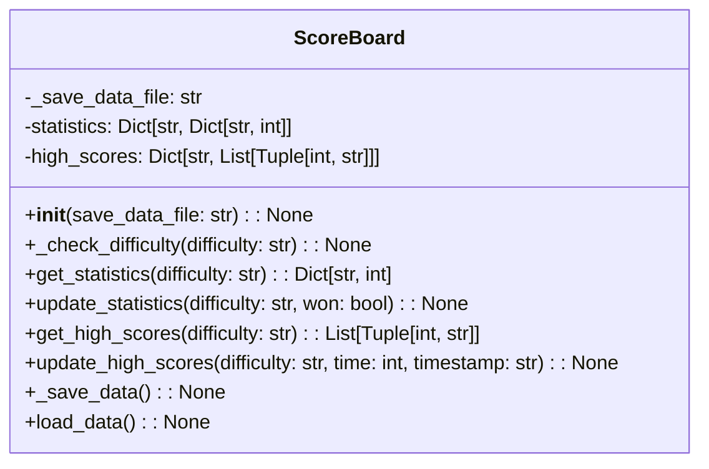
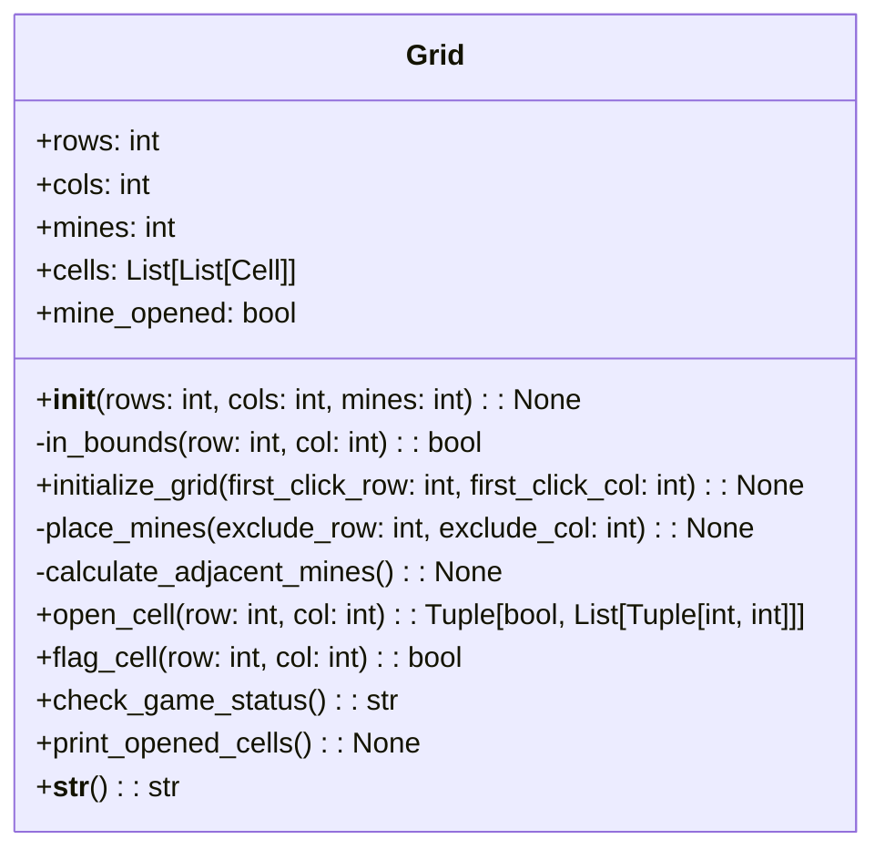
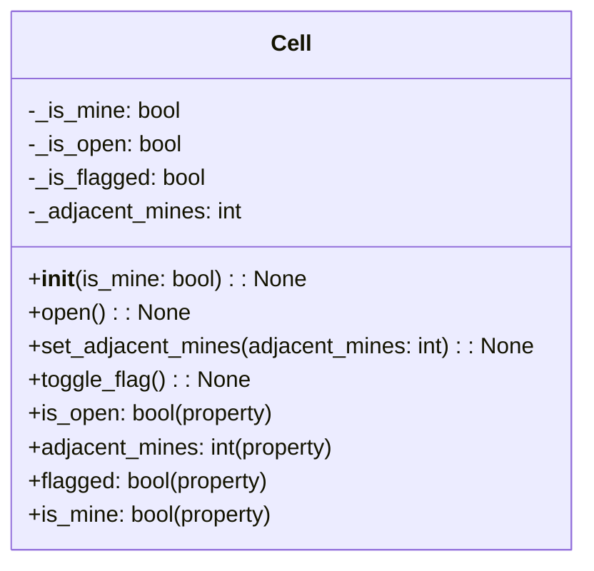

| name                    | type                                              | description                                                                                           |
|-------------------------|---------------------------------------------------|-------------------------------------------------------------------------------------------------------|
| \_\_init\_\_                | public instance method (None)                      | Initializes the ScoreBoard object, setting default values for the statistics and high_scores.         |
| get_statistics          | public instance method (Dict[str, int])            | Returns the statistics dictionary for a given difficulty level.                                       |
| update_statistics       | public instance method (None)                      | Updates the game statistics for the given difficulty level.                                           |
| get_high_scores         | public instance method (List[Tuple[int, str]])     | Returns the high_scores dictionary for a given difficulty level.                                      |
| update_high_scores      | public instance method (None)                      | Updates the high scores data for the given difficulty level.                                         |
| _save_data_file         | private instance attribute (str)                  | The filename of the save file that stores the statistics and high_scores data.                        |
| _statistics             | private instance attribute (Dict[str, Dict[str, int]]) | A dictionary containing game statistics for each difficulty level.                                    |
| _high_scores            | private instance attribute (Dict[str, List[Tuple[int, str]]]) | A dictionary containing the high scores for each difficulty level.                                    |
| _check_difficulty       | private instance method (None)                     | A helper function to check if the input difficulty is valid.                                          |
| _save_data              | private instance method (None)                     | Saves the statistics and high_scores data to a file on disk.                                          |
| _load_data              | private instance method (None)                     | Loads the statistics and high_scores data from a file on disk, or initializes the data if not found.  |

### Grid class description

| Name                   | Type                 | Description                                                  |
|------------------------|----------------------|--------------------------------------------------------------|
| rows                   | int                  | Number of rows in the grid.                                  |
| cols                   | int                  | Number of columns in the grid.                               |
| mines                  | int                  | Number of mines to be placed in the grid.                   |
| cells                  | List[List[Cell]]     | A 2D list representing the grid with instances of `Cell`.    |
| mine_opened            | bool                 | Whether a mine has been opened or not.                       |
| __init__()             | constructor          | Initializes the grid with rows, columns, and mines.         |
| in_bounds()            | private method       | Checks if a cell's row and column are within grid bounds.    |
| initialize_grid()      | method               | Initializes the grid by placing mines and calculating adjacent mines. |
| place_mines()          | private method       | Places mines in the grid, excluding the first clicked cell.  |
| calculate_adjacent_mines() | private method    | Calculates the number of adjacent mines for each cell.       |
| open_cell()            | method               | Opens a cell and returns a boolean indicating if a mine was opened and a list of opened cells. |
| flag_cell()            | method               | Toggles the flag on a cell and returns its flagged state.    |
| check_game_status()    | method               | Checks the game status and returns "won", "lost", or "ongoing". |
| print_opened_cells()   | method               | Prints a visual representation of the opened cells in the grid. |
| __str__()              | special method       | Returns a string representation of the grid with mines and adjacent mine counts. |

---

| Property / Function | Description |
|---------------------|-------------|
| `_is_mine`          | A boolean value indicating if the cell contains a mine. |
| `_is_open`          | A boolean value indicating if the cell has been opened. |
| `_is_flagged`       | A boolean value indicating if the cell has been flagged. |
| `_adjacent_mines`   | An integer value representing the number of adjacent mines. |
| `__init__(is_mine: bool)` | Constructor, initializes the Cell object with the given `is_mine` value. |
| `open()`            | Sets the cell to the opened state. |
| `set_adjacent_mines(adjacent_mines: int)` | Sets the number of adjacent mines. |
| `toggle_flag()`     | Toggles the flagged state of the cell. |
| `is_open` (property) | Returns whether the cell is opened or not. |
| `adjacent_mines` (property) | Returns the number of adjacent mines. |
| `flagged` (property) | Returns whether the cell is flagged or not. |
| `is_mine` (property) | Returns whether the cell contains a mine or not. |

---