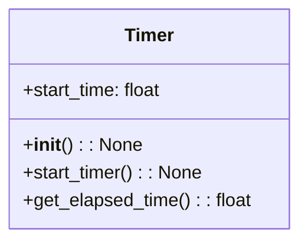
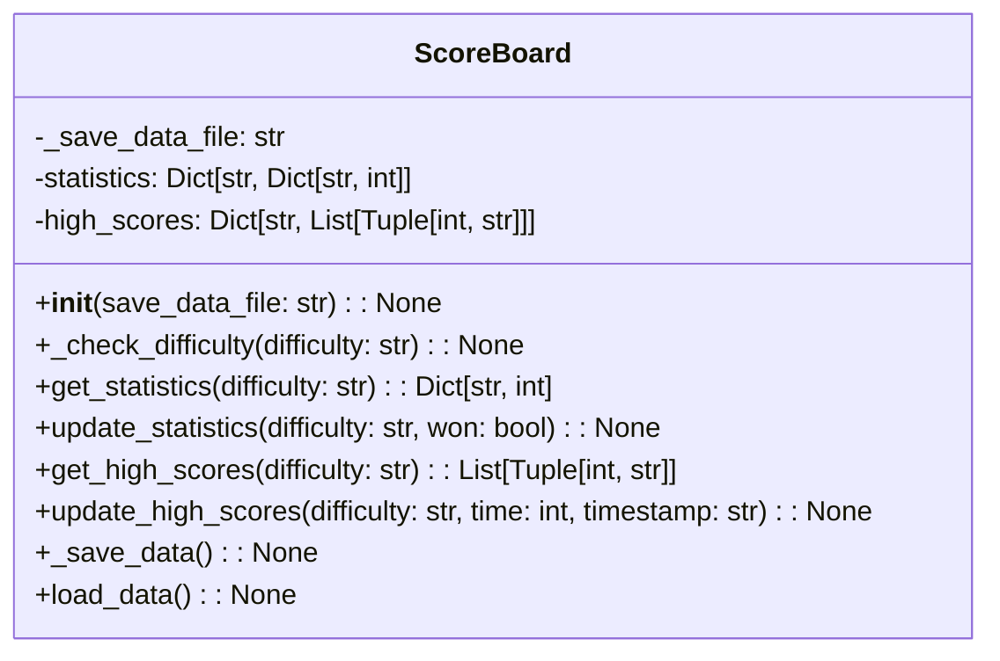
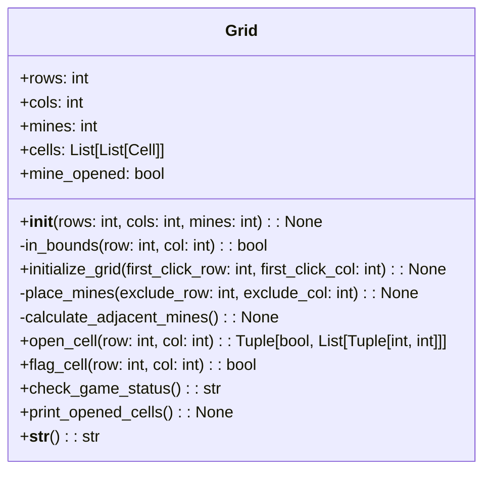
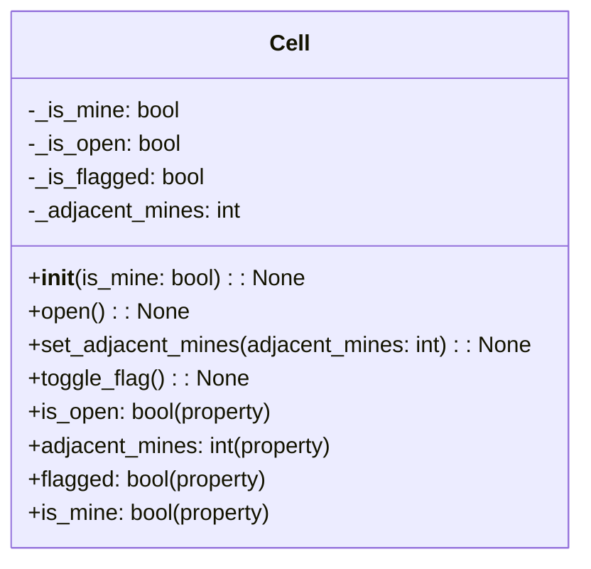

| name            | type                              | description                                              |
| --------------- | --------------------------------- | -------------------------------------------------------- |
| \_\_init\_\_        | instance method, public, None     | Initializes a Timer object with start_time set to 0.0    |
| start_timer     | instance method, public, None     | Starts the timer by setting start_time to the current time |
| get_elapsed_time| instance method, public, float    | Returns the elapsed time since start_timer was called   |
| start_time      | instance attribute, private, float| Stores the start time of the timer                      |

| name             | type                                         | description                                              |
| ---------------- | -------------------------------------------- | -------------------------------------------------------- |
| \_\_init\_\_         | instance method, public, None                | Initializes a ScoreBoard object with default values     |
| get_statistics   | instance method, public, Dict[str, int]      | Returns the statistics for the given difficulty         |
| update_statistics| instance method, public, None                | Updates the statistics for the given difficulty         |
| get_high_scores  | instance method, public, List[Tuple[int, str]]| Returns the high scores for the given difficulty       |
| update_high_scores| instance method, public, None               | Updates the high scores for the given difficulty        |
| _save_data       | instance method, private, None               | Saves the statistics and high scores to a JSON file     |
| _load_data       | instance method, private, None               | Loads the statistics and high scores from a JSON file   |
| _check_difficulty| instance method, private, None               | Checks if the given difficulty is valid                 |
| _save_data_file  | instance attribute, private, str             | Stores the path to the save data file                   |
| _statistics      | instance attribute, private, Dict[str, Dict[str, int]]| Stores the statistics for each difficulty          |
| _high_scores     | instance attribute, private, Dict[str, List[Tuple[int, str]]]| Stores the high scores for each difficulty  |

### Grid class description

| name                 | type                              | description                                                  |
| -------------------- | --------------------------------- | ------------------------------------------------------------ |
| \_\_init\_\_             | instance method, public, None     | Initializes a Grid object with rows, cols, and mines         |
| initialize_grid      | instance method, public, None     | Initializes the grid with mines and adjacent mines after the first click |
| open_cell            | instance method, public, Tuple[bool, List[Tuple[int, int]]] | Opens a cell and returns whether it's a mine and a list of opened cells |
| flag_cell            | instance method, public, bool     | Toggles the flag status of a cell and returns the new flag state |
| check_game_status    | instance method, public, str      | Checks the game status and returns "lost", "won", or "ongoing" |
| print_opened_cells   | instance method, public, None     | Prints the opened cells in the grid                           |
| \_\_str\_\_              | instance method, public, str      | Returns a string representation of the grid                   |
| rows                 | instance attribute, private, int  | Number of rows in the grid                                   |
| cols                 | instance attribute, private, int  | Number of columns in the grid                                |
| mines                | instance attribute, private, int  | Number of mines in the grid                                  |
| cells                | instance attribute, private, List[List[Cell]] | 2D list of Cell objects representing the grid                |
| mine_opened          | instance attribute, private, bool | Flag indicating if a mine has been opened                    |
| in_bounds            | instance method, private, bool    | Checks if the given row and col are within the grid bounds   |
| place_mines          | instance method, private, None    | Places mines on the grid, excluding the cell specified       |
| calculate_adjacent_mines | instance method, private, None | Calculates the number of adjacent mines for each cell        |

---

| name             | type                               | description                                              |
| ---------------- | ---------------------------------- | -------------------------------------------------------- |
| \_\_init\_\_         | instance method, public, None      | Initializes a Cell object with default values           |
| is_open          | property, public, bool             | Returns the value of _is_open attribute                 |
| open             | instance method, public, None      | Sets the _is_open attribute to True                     |
| set_adjacent_mines| instance method, public, None     | Sets the _adjacent_mines attribute to the given value   |
| adjacent_mines   | property, public, int              | Returns the value of _adjacent_mines attribute          |
| toggle_flag      | instance method, public, None      | Toggles the value of _is_flagged attribute              |
| flagged          | property, public, bool             | Returns the value of _is_flagged attribute              |
| is_mine          | property, public, bool             | Returns the value of _is_mine attribute                 |
| put_mine         | instance method, public, None      | Sets the _is_mine attribute to True                     |
| _is_mine         | instance attribute, private, bool  | Stores whether the cell contains a mine                 |
| _is_open         | instance attribute, private, bool  | Stores whether the cell is open                         |
| _is_flagged      | instance attribute, private, bool  | Stores whether the cell is flagged                      |
| _adjacent_mines  | instance attribute, private, int   | Stores the number of adjacent mines                     |

---