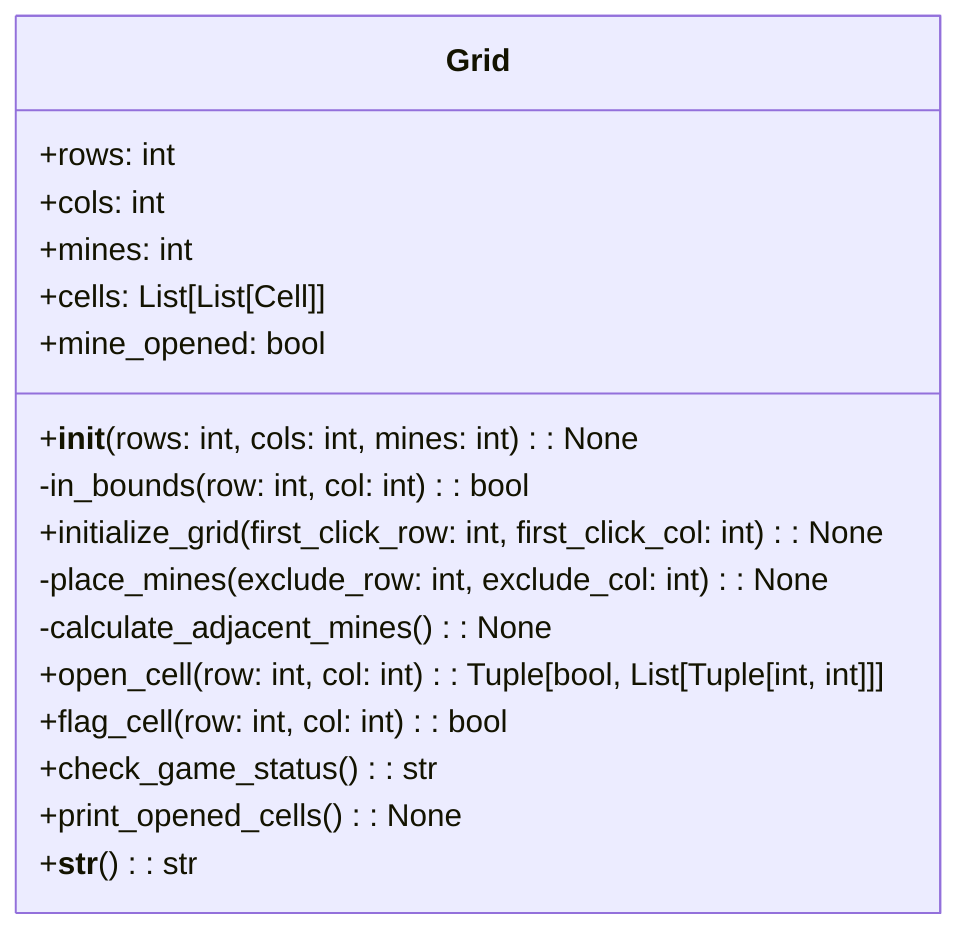

### Grid class description

| Name                   | Type                 | Description                                                  |
|------------------------|----------------------|--------------------------------------------------------------|
| rows                   | int                  | Number of rows in the grid.                                  |
| cols                   | int                  | Number of columns in the grid.                               |
| mines                  | int                  | Number of mines to be placed in the grid.                   |
| cells                  | List[List[Cell]]     | A 2D list representing the grid with instances of `Cell`.    |
| mine_opened            | bool                 | Whether a mine has been opened or not.                       |
| __init__()             | constructor          | Initializes the grid with rows, columns, and mines.         |
| in_bounds()            | private method       | Checks if a cell's row and column are within grid bounds.    |
| initialize_grid()      | method               | Initializes the grid by placing mines and calculating adjacent mines. |
| place_mines()          | private method       | Places mines in the grid, excluding the first clicked cell.  |
| calculate_adjacent_mines() | private method    | Calculates the number of adjacent mines for each cell.       |
| open_cell()            | method               | Opens a cell and returns a boolean indicating if a mine was opened and a list of opened cells. |
| flag_cell()            | method               | Toggles the flag on a cell and returns its flagged state.    |
| check_game_status()    | method               | Checks the game status and returns "won", "lost", or "ongoing". |
| print_opened_cells()   | method               | Prints a visual representation of the opened cells in the grid. |
| __str__()              | special method       | Returns a string representation of the grid with mines and adjacent mine counts. |

