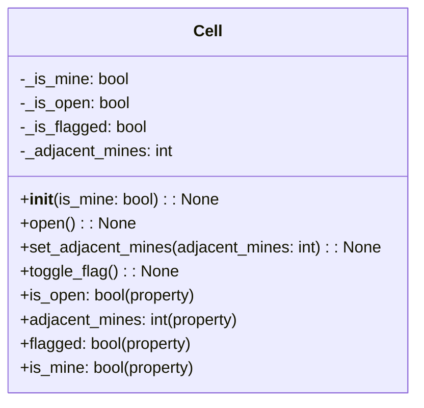

---

| Property / Function | Description |
|---------------------|-------------|
| `_is_mine`          | A boolean value indicating if the cell contains a mine. |
| `_is_open`          | A boolean value indicating if the cell has been opened. |
| `_is_flagged`       | A boolean value indicating if the cell has been flagged. |
| `_adjacent_mines`   | An integer value representing the number of adjacent mines. |
| `__init__(is_mine: bool)` | Constructor, initializes the Cell object with the given `is_mine` value. |
| `open()`            | Sets the cell to the opened state. |
| `set_adjacent_mines(adjacent_mines: int)` | Sets the number of adjacent mines. |
| `toggle_flag()`     | Toggles the flagged state of the cell. |
| `is_open` (property) | Returns whether the cell is opened or not. |
| `adjacent_mines` (property) | Returns the number of adjacent mines. |
| `flagged` (property) | Returns whether the cell is flagged or not. |
| `is_mine` (property) | Returns whether the cell contains a mine or not. |

---