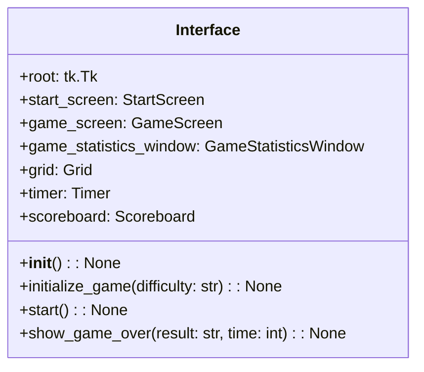
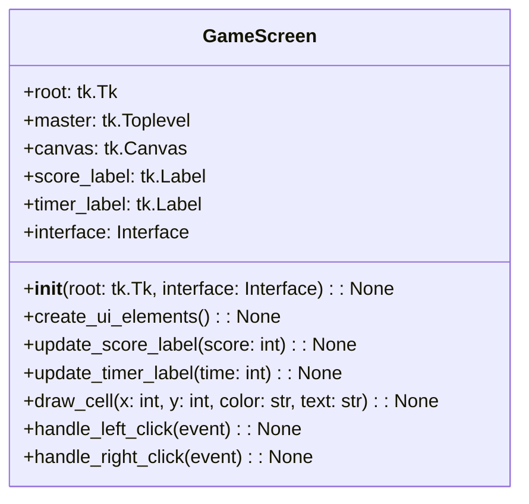
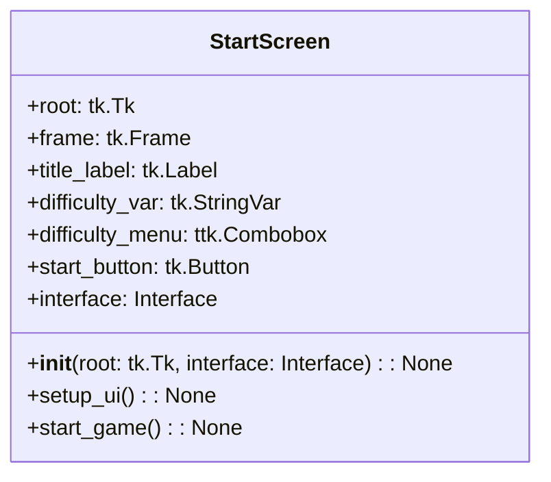
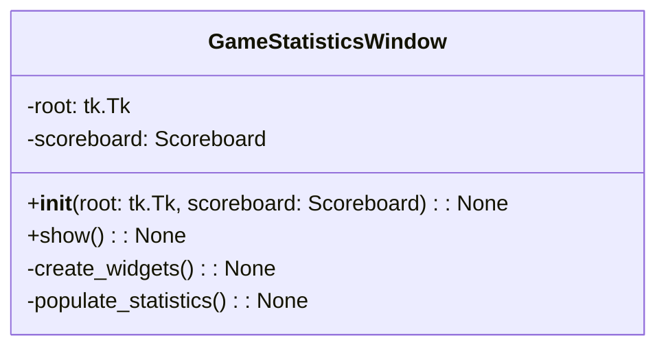
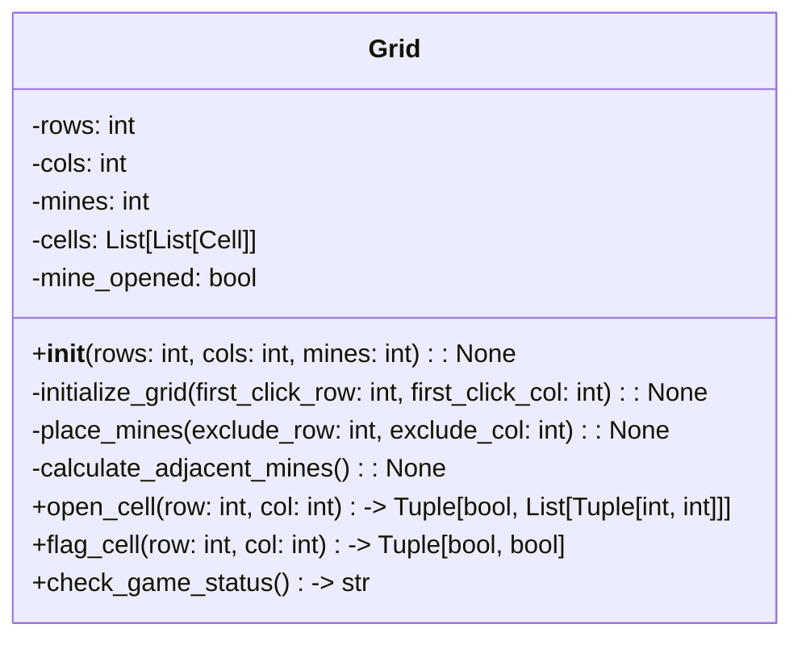
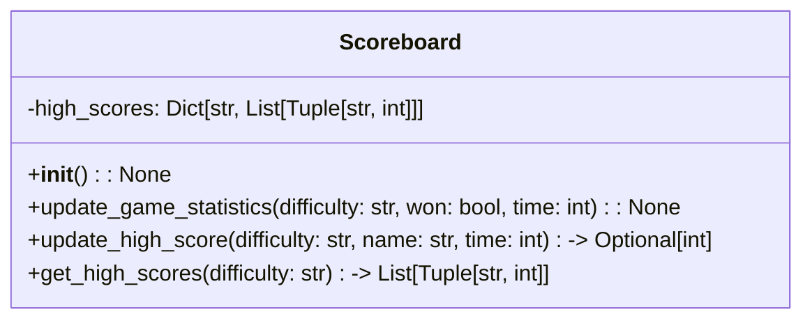
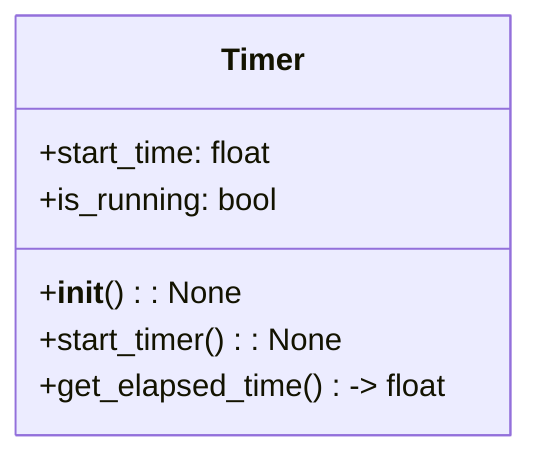

# Class Diagrams

Member variables:
- `root`: The root window of the tkinter application.
- `start_screen`: An instance of the StartScreen class, representing the start screen of the game.
- `game_screen`: An instance of the GameScreen class, representing the main game screen.
- `game_statistics_window`: An instance of the GameStatisticsWindow class, representing the game statistics window.
- `grid`: An instance of the Grid class, representing the minesweeper grid.
- `timer`: An instance of the Timer class, responsible for keeping track of the game time.
- `scoreboard`: An instance of the Scoreboard class, responsible for managing game statistics and high scores.

Member functions:
- `__init__()`: The constructor method for the Interface class, initializing all required instances of other classes.
- `initialize_game(difficulty: str)`: Initializes a new game with the specified difficulty level, creating a new Grid, Timer, and GameScreen.
- `start()`: Starts the tkinter main loop and displays the start screen.
- `show_game_over(result: str, time: int)`: Displays the game over screen with the appropriate result (win or loss) and the time it took to complete the game.

---

Member variables:
- `root`: The root window of the tkinter application.
- `master`: A Toplevel widget, which serves as the container for the game screen.
- `canvas`: A tkinter Canvas widget, responsible for drawing the minesweeper grid.
- `score_label`: A tkinter Label widget, used to display the current score (number of mines remaining).
- `timer_label`: A tkinter Label widget, used to display the elapsed time.
- `interface`: A reference to the Interface class instance.

Member functions:
- `__init__(root: tk.Tk, interface: Interface)`: The constructor method for the GameScreen class, initializing all required instances of tkinter widgets and taking a reference to the Interface class instance.
- `create_ui_elements()`: Creates and positions all required UI elements (canvas, score_label, timer_label) within the master Toplevel widget.
- `update_score_label(score: int)`: Updates the score_label with the current score (number of mines remaining).
- `update_timer_label(time: int)`: Updates the timer_label with the current elapsed time.
- `draw_cell(x: int, y: int, color: str, text: str)`: Draws a cell on the canvas at the specified coordinates, with the given color and text.
- `handle_left_click(event)`: Handles a left-click event on the canvas, calling the appropriate functions in the Grid class and updating the UI accordingly.
- `handle_right_click(event)`: Handles a right-click event on the canvas, calling the appropriate functions in the Grid class and updating the UI accordingly.

---

Member variables:

- `root`: The Tkinter root window.
- `frame`: The main frame that contains all the UI elements.
- `title_label`: The label displaying the title of the game.
- `difficulty_var`: A Tkinter StringVar for storing the current difficulty level selected.
- `difficulty_menu`: A Tkinter ttk.Combobox for selecting the difficulty level.
- `start_button`: A Tkinter button for starting the game.
- `interface`: A reference to the Interface class.

Member functions:

- `__init__(root: tk.Tk, interface: Interface)`: Constructor, initializes the StartScreen object with the root window and a reference to the Interface class.
- `setup_ui()`: Sets up the UI elements for the StartScreen, such as the title, difficulty selection, and start button.
- `start_game()`: Callback function for the start button; starts the game with the selected difficulty level and switches to the game screen.

---

**Member Variables:**

- `root`: A reference to the root Tkinter window (tk.Tk).
- `scoreboard`: A reference to the Scoreboard instance, which is used to access and display game statistics.

**Member Functions:**

- `__init__(root: tk.Tk, scoreboard: Scoreboard)`: The constructor initializes the GameStatisticsWindow instance, taking a reference to the root Tkinter window and the Scoreboard instance.

- `show()`: Displays the game statistics window.

- `create_widgets()`: (private) Creates and configures the necessary widgets (labels, buttons, etc.) to display the game statistics.

- `populate_statistics()`: (private) Retrieves the game statistics from the Scoreboard instance and populates the window's widgets with the statistics.

---

Member variables:

- `rows`: The number of rows in the grid.
- `cols`: The number of columns in the grid.
- `mines`: The number of mines in the grid.
- `cells`: A 2D list of Cell objects representing the grid.
- `mine_opened`: A boolean value indicating if a mine has been opened.

Member functions:

- `__init__(rows: int, cols: int, mines: int)`: Constructor, initializes the Grid object with the given rows, columns, and mines.
- `initialize_grid(first_click_row: int, first_click_col: int)`: Initializes the grid by placing mines and calculating adjacent mines. Excludes the first clicked cell from having a mine.
- `place_mines(exclude_row: int, exclude_col: int)`: Places mines randomly in the grid, excluding the specified cell.
- `calculate_adjacent_mines()`: Calculates and stores the number of adjacent mines for each cell in the grid.
- `open_cell(row: int, col: int) -> Tuple[bool, List[Tuple[int, int]]]`: Opens a cell and returns a tuple with a boolean indicating if a mine was opened and a list of coordinates of opened cells.
- `flag_cell(row: int, col: int) -> Tuple[bool, bool]`: Flags or unflags a cell and returns a tuple with two booleans: the first indicates if the cell was flagged, and the second indicates if the cell was unflagged.
- `check_game_status() -> str`: Checks the current game status and returns one of the following strings: "ongoing", "won", or "lost".

---

**Member variables:**

- `high_scores`: A dictionary that stores the high scores for each difficulty level. The keys are the difficulty levels (e.g., "beginner", "intermediate", "advanced"), and the values are lists of tuples containing the player name and their respective score.

**Member functions:**

- `__init__(): None`: The constructor initializes the high_scores dictionary with empty lists for each difficulty level.
- `update_game_statistics(difficulty: str, won: bool, time: int): None`: This function updates the game statistics, including the high scores, based on the difficulty level, whether the game was won, and the time taken to complete the game.
- `update_high_score(difficulty: str, name: str, time: int) -> Optional[int]`: This function updates the high scores for a specific difficulty level with a new entry if the given time is within the top scores. It returns the new rank of the player in the high scores list if their score is within the top scores, otherwise None.
- `get_high_scores(difficulty: str) -> List[Tuple[str, int]]`: This function returns the high scores list for a specific difficulty level. The list contains tuples with the player name and their respective score.

---

Member variables:

- `start_time`: A float value representing the start time of the timer.
- `is_running`: A boolean value indicating whether the timer is running or not.

Member functions:

- `__init__()`: Constructor, initializes the Timer object with default values.
- `start_timer()`: Starts the timer by storing the current time in the `start_time` member variable and setting `is_running` to True.
- `get_elapsed_time() -> float`: Returns the elapsed time in seconds since the timer was started. If the timer is not running, it returns 0.