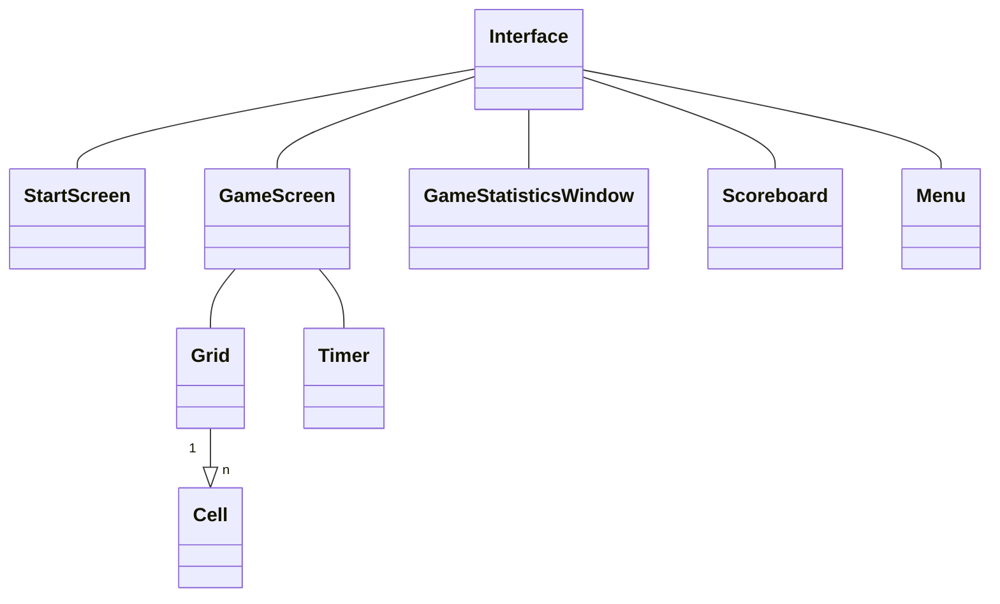
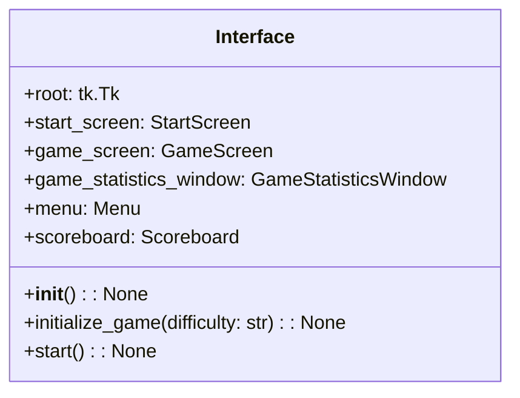
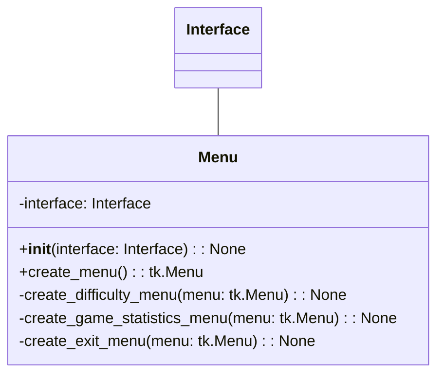
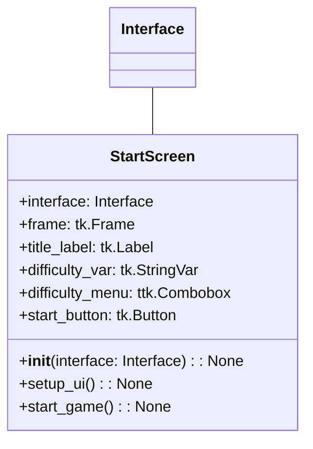
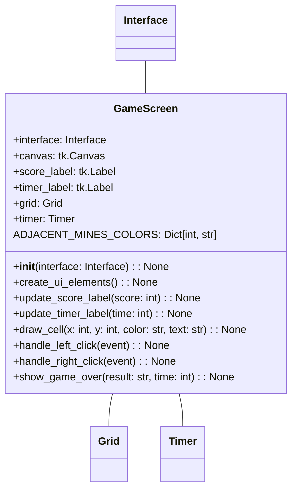
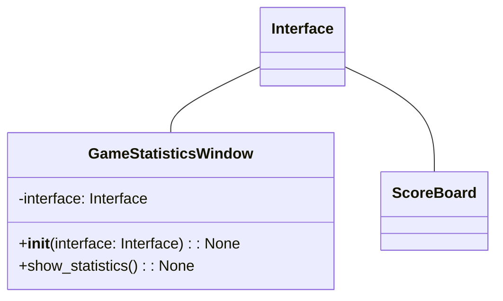
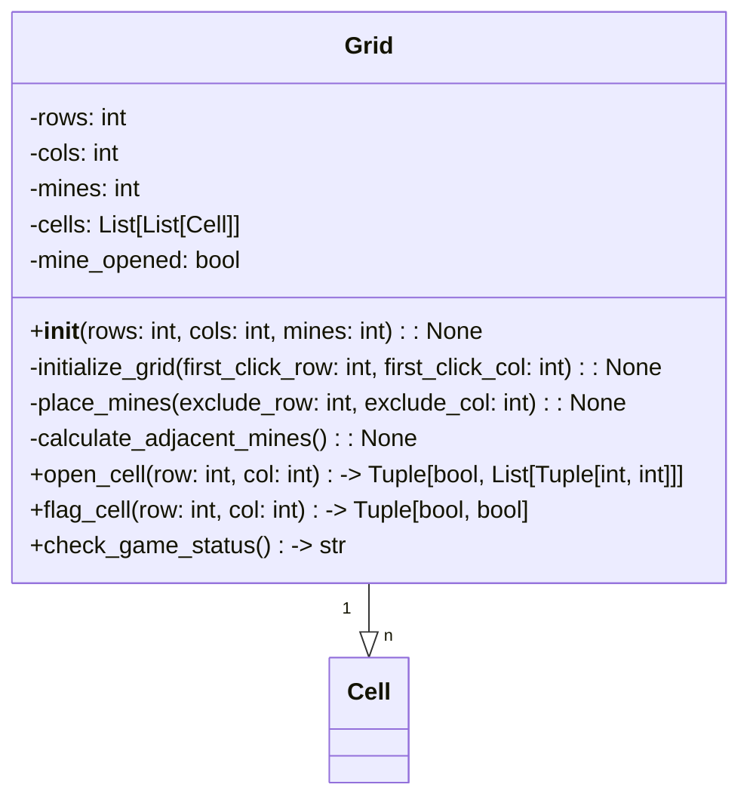
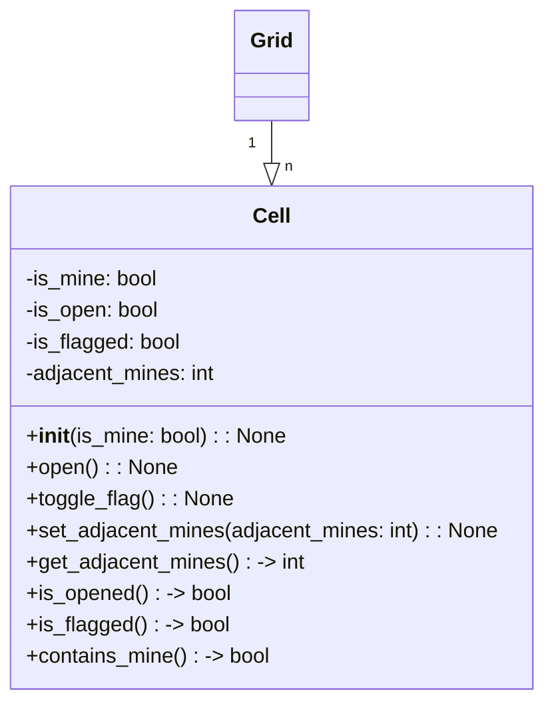
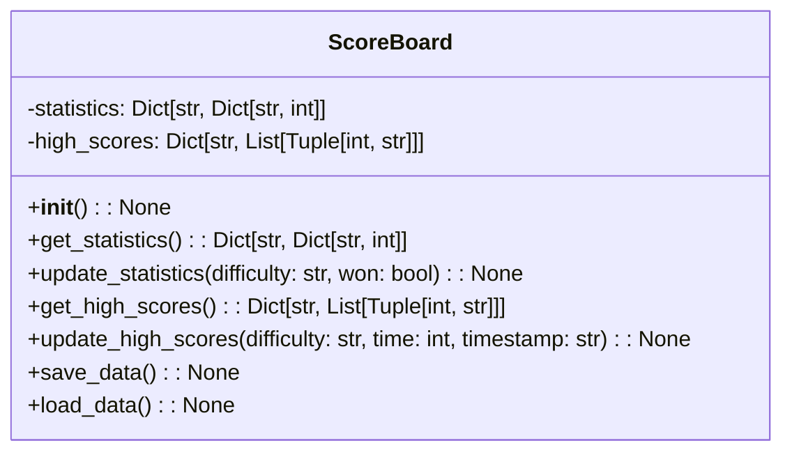
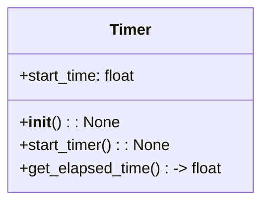

# Class Diagrams

Member variables:
- `root`: The root window of the tkinter application.
- `start_screen`: An instance of the StartScreen class, representing the start screen of the game.
- `game_screen`: An instance of the GameScreen class, representing the main game screen.
- `game_statistics_window`: An instance of the GameStatisticsWindow class, representing the game statistics window.
- `menu`: An interface of the Menu class, responsible for managing interface on menu bar.
- `scoreboard`: An instance of the Scoreboard class, responsible for managing game statistics and high scores.

Member functions:
- `__init__()`: The constructor method for the Interface class, initializing all required instances of other classes.
- `initialize_game(difficulty: str)`: Initializes a new game with the specified difficulty level, creating a new GameScreen.
- `start()`: Starts the tkinter main loop and displays the start screen.

---

**Member Variables:**

*   `interface`: A reference to the Interface instance, which is used to access various functionality and components.

**Member Functions:**

*   `__init__(interface: Interface)`: The constructor initializes the Menu instance, taking a reference to the root Tkinter window and the Interface instance.
    
*   `create_menu()`: Creates and configures the menu bar with its menu items, and returns the created tk.Menu instance.
    
*   `create_difficulty_menu(menu: tk.Menu)`: (private) Creates and configures the Difficulty menu with its menu items and adds it to the main menu.
    
*   `create_game_statistics_menu(menu: tk.Menu)`: (private) Creates and configures the Game Statistics menu with its menu items and adds it to the main menu.
    
*   `create_exit_menu(menu: tk.Menu)`: (private) Creates and configures the Exit menu with its menu items and adds it to the main menu.
    
---

Member variables:

- `interface`: A reference to the Interface class.
- `frame`: The main frame that contains all the UI elements.
- `title_label`: The label displaying the title of the game.
- `difficulty_var`: A Tkinter StringVar for storing the current difficulty level selected.
- `difficulty_menu`: A Tkinter ttk.Combobox for selecting the difficulty level.
- `start_button`: A Tkinter button for starting the game. When this button is pushed, selected difficulty on difficulty_menu is passed to the Interface and start game on the selected difficuly.

Member functions:

- `__init__(interface: Interface)`: Constructor, initializes the StartScreen object with a reference to the Interface class.
- `setup_ui()`: Sets up the UI elements for the StartScreen, such as the title, difficulty selection, and start button.
- `start_game()`: Callback function for the start button; starts the game with the selected difficulty level and switches to the game screen.

---

Member variables:
- `root`: The root window of the tkinter application.
- `master`: A Toplevel widget, which serves as the container for the game screen.
- `canvas`: A tkinter Canvas widget, responsible for drawing the minesweeper grid.
- `score_label`: A tkinter Label widget, used to display the current score (number of mines remaining).
- `timer_label`: A tkinter Label widget, used to display the elapsed time.
- `interface`: A reference to the Interface class instance.
- `grid`: An instance of the Grid class, representing the minesweeper grid.
- `timer`: An instance of the Timer class, responsible for keeping track of the game time.
- `ADJACENT_MINES_COLORS`: A dictionary containing the colors for each number of adjacent mines. ["blue","green","red","dark blue","maroon","cyan","black","gray"]

Member functions:
- `__init__(root: tk.Tk, interface: Interface)`: The constructor method for the GameScreen class, initializing all required instances of tkinter widgets and taking a reference to the Interface class instance.
- `create_ui_elements()`: Creates and positions all required UI elements (canvas, score_label, timer_label) within the master Toplevel widget.
- `update_score_label(score: int)`: Updates the score_label with the current score (number of mines remaining).
- `update_timer_label(time: int)`: Updates the timer_label with the current elapsed time.
- `draw_cell(x: int, y: int, color: str, text: str)`: Draws a cell on the canvas at the specified coordinates, with the given color and text.
- `handle_left_click(event)`: Handles a left-click event on the canvas, calling the appropriate functions in the Grid class and updating the UI accordingly.
- `handle_right_click(event)`: Handles a right-click event on the canvas, calling the appropriate functions in the Grid class and updating the UI accordingly.
- `show_game_over(result: str, time: int)`: Displays the game over screen with the appropriate result (win or loss) and the time it took to complete the game.

scoreboard_data is located at ScoreBoard. Access scoreboard_data via Interface.

Member variables:
- `interface`: A reference to the Interface instance.

Member functions:
- `__init__(interface: Interface)`: Constructor that initializes the GameStatisticsWindow instance with the given Interface instance.
- `show_statistics()`: Displays the game statistics window with the current scoreboard data.

---

Member variables:

- `rows`: The number of rows in the grid.
- `cols`: The number of columns in the grid.
- `mines`: The number of mines in the grid.
- `cells`: A 2D list of Cell objects representing the grid.
- `mine_opened`: A boolean value indicating if a mine has been opened.

Member functions:

- `__init__(rows: int, cols: int, mines: int)`: Constructor, initializes the Grid object with the given rows, columns, and mines.
- `initialize_grid(first_click_row: int, first_click_col: int)`: Initializes the grid by placing mines and calculating adjacent mines. Excludes the first clicked cell from having a mine.
- `place_mines(exclude_row: int, exclude_col: int)`: Places mines randomly in the grid, excluding the specified cell. Because it must satisfy "First click safety". First click safety: Ensure that the first click of the game never reveals a mine, to allow players a fair start. You can achieve this by generating the minefield after the first click, making sure not to place mines in the initially clicked cell or its immediate neighbors.
- `calculate_adjacent_mines()`: Calculates and stores the number of adjacent mines for each cell in the grid.
- `open_cell(row: int, col: int) -> Tuple[bool, List[Tuple[int, int]]]`: Opens a cell and returns a tuple with a boolean indicating if a mine was opened and a list of coordinates of opened cells.
- `flag_cell(row: int, col: int) -> Tuple[bool, bool]`: Flags or unflags a cell and returns a tuple with two booleans: the first indicates if the cell was flagged, and the second indicates if the cell was unflagged.
- `check_game_status() -> str`: Checks the current game status and returns one of the following strings: "ongoing", "won", or "lost".

---

Member variables:
- `is_mine`: A boolean value indicating if the cell contains a mine.
- `is_open`: A boolean value indicating if the cell has been opened.
- `is_flagged`: A boolean value indicating if the cell has been flagged.
- `adjacent_mines`: An integer value representing the number of adjacent mines.

Member functions:
- `__init__(is_mine: bool)`: Constructor, initializes the Cell object with the given `is_mine` value.
- `open()`: Sets the cell to the opened state.
- `toggle_flag()`: Toggles the flagged state of the cell.
- `set_adjacent_mines(adjacent_mines: int)`: Sets the number of adjacent mines.
- `get_adjacent_mines() -> int`: Returns the number of adjacent mines.
- `is_opened() -> bool`: Returns whether the cell is opened or not.
- `is_flagged() -> bool`: Returns whether the cell is flagged or not.
- `contains_mine() -> bool`: Returns whether the cell contains a mine or not.

---

Member variables:
- `statistics`: A dictionary containing the game statistics for each difficulty level (keys: "beginner", "intermediate", "advanced"). Each value is another dictionary containing keys "games_played", "games_won", and "win_percentage".
- `high_scores`: A dictionary containing the high scores for each difficulty level (keys: "beginner", "intermediate", "advanced"). Each value is a list of tuples, where each tuple contains the high score (elapsed time) as an integer and the timestamp as a string (e.g., {"beginner": [(29, "2009/1/2"), (30, "2009/1/5"), (44, "2019/1/2")]}).

Member functions:
- `__init__()`: Initializes the ScoreBoard object, setting default values for the statistics and high_scores dictionaries.
- `get_statistics()`: Returns the statistics dictionary.
- `update_statistics(difficulty: str, won: bool)`: Updates the game statistics for the given difficulty level, incrementing the games_played count and, if the game was won, incrementing the games_won count and recalculating the win_percentage.
- `get_high_scores()`: Returns the high_scores dictionary.
- `update_high_scores(difficulty: str, time: int, timestamp: str)`: Updates the high scores data for the given difficulty level. If the new score is one of the top scores, it will be added to the list in the correct position, and the lowest score will be removed if the list exceeds the maximum number of stored scores (e.g., 10).
- `save_data()`: Saves the statistics and high_scores data to a file on disk.
- `load_data()`: Loads the statistics and high_scores data from a file on disk, if it exists. If the file does not exist, it initializes the data with default values.

---

Member variables:

- `start_time`: A float value representing the start time of the timer.

Member functions:

- `__init__()`: Constructor, initializes the Timer object with default values.
- `start_timer()`: Starts the timer by storing the current time in the `start_time` member variable and setting `is_running` to True.
- `get_elapsed_time() -> float`: Returns the elapsed time in seconds since the timer was started. If the timer is not running, it returns 0.
